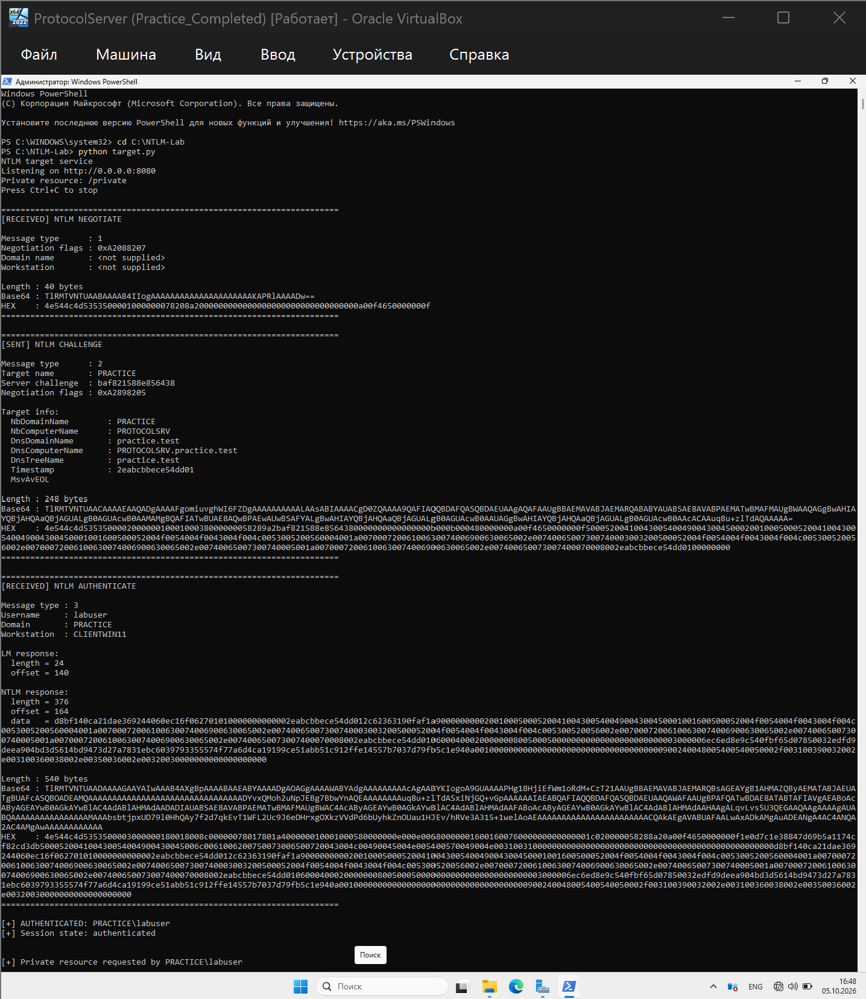
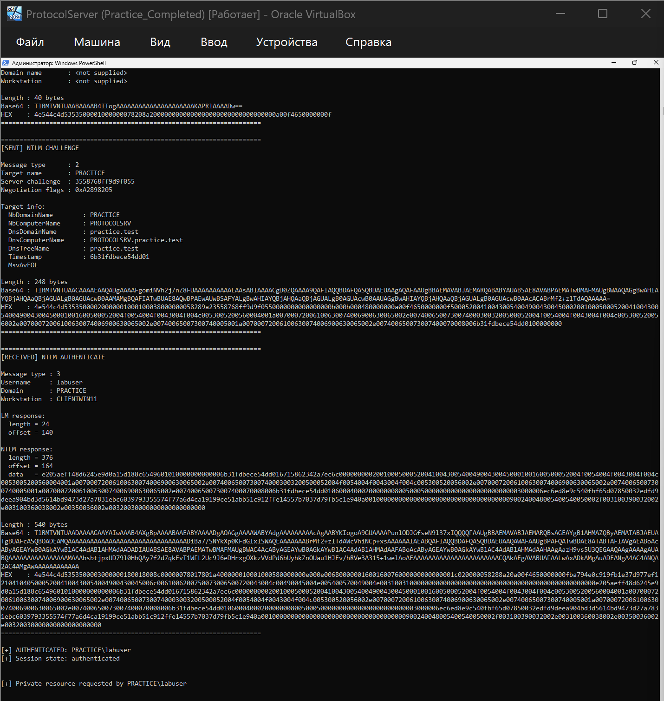
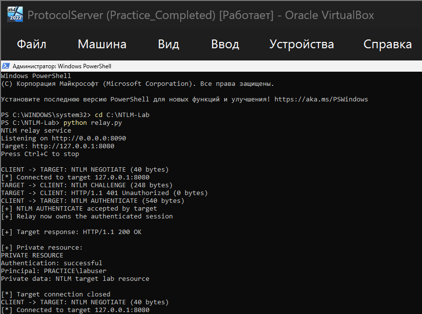
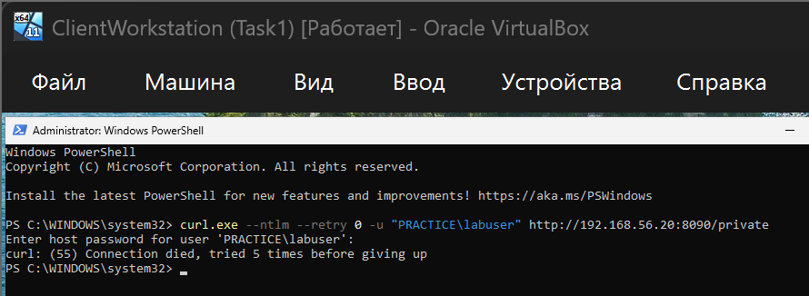

# NTLM Relay Lab

## Статус

Реализованы два сервиса:

* `target.py` — целевой HTTP-сервис с NTLM-аутентификацией и приватным ресурсом;
* `relay.py` — HTTP relay, который передаёт NTLM-сообщения между клиентом и target-сервисом.

Работа выполнялась в изолированном учебном стенде.

## Суть работы

NTLM использует схему challenge-response и обменивается тремя основными сообщениями:

1. `NTLM NEGOTIATE` — клиент начинает аутентификацию.
2. `NTLM CHALLENGE` — сервер отправляет challenge.
3. `NTLM AUTHENTICATE` — клиент отправляет ответ на challenge.

В данной реализации relay находится между клиентом и target-сервисом и передаёт NTLM-токены без изменения:

```text
Client
  |
  | NTLM NEGOTIATE
  v
Relay
  |
  | NTLM NEGOTIATE
  v
Target
  |
  | NTLM CHALLENGE
  v
Relay
  |
  | NTLM CHALLENGE
  v
Client
  |
  | NTLM AUTHENTICATE
  v
Relay
  |
  | NTLM AUTHENTICATE
  v
Target
```

После успешного `NTLM AUTHENTICATE` relay не пересылает полученный от target успешный ответ клиенту. Вместо этого relay продолжает использовать уже аутентифицированное соединение с target и самостоятельно запрашивает приватный ресурс `/private` без нового заголовка `Authorization`.

## Target-сервис

`target.py` запускает HTTP-сервис на порту `8080`.

Основные функции target:

* принимает штатную NTLM-аутентификацию;
* если запрос приходит без `Authorization`, отвечает `401 Unauthorized` с заголовком `WWW-Authenticate: NTLM`, инициируя NTLM-аутентификацию;
* разбирает и выводит сообщения NTLM Type 1, Type 2 и Type 3;
* выводит основные поля NTLM-сообщений;
* после успешной аутентификации устанавливает состояние сессии `authenticated = True`;
* сохраняет имя аутентифицированного пользователя в `principal`;
* предоставляет приватный ресурс `/private` только для аутентифицированной сессии;
* после успешной аутентификации позволяет получить `/private` в рамках той же сессии без нового заголовка `Authorization`.

Пример ответа приватного ресурса:

```text
PRIVATE RESOURCE
Authentication: successful
Principal: PRACTICE\\labuser
Private data: NTLM target lab resource
```

## Relay-сервис

`relay.py` по умолчанию запускает HTTP-сервис на порту `8090` и подключается к target-сервису на `127.0.0.1:8080`.

Relay выполняет следующую последовательность:

1. получает `NTLM NEGOTIATE` от клиента;
2. передаёт его target-сервису;
3. получает от target `NTLM CHALLENGE`;
4. передаёт challenge клиенту;
5. получает от клиента `NTLM AUTHENTICATE`;
6. передаёт его target-сервису;
7. если target отвечает `HTTP/1.1 200 OK`, считает аутентификацию принятой;
8. успешный ответ после Type 3 клиенту не пересылается — relay использует аутентифицированную сессию самостоятельно;
9. по тому же TCP-соединению relay запрашивает `/private` без нового `Authorization`;
10. выводит полученные приватные данные в консоль.

Для NTLM важно сохранение одного TCP-соединения с target на время всей последовательности аутентификации. Поэтому relay сохраняет соединение с target между Type 1, Type 2 и Type 3 и не создаёт новое соединение между отдельными этапами handshake.

При обработке HTTP-запроса relay полностью вычитывает тело запроса в соответствии с `Content-Length` перед его передачей target-сервису. Это позволяет корректно обработать запрос целиком, а не только HTTP-заголовки.

`relay.py` не использует `spnego`: он не выполняет NTLM-аутентификацию самостоятельно, а только передаёт NTLM-сообщения между клиентом и target и сохраняет соответствующее TCP-соединение.

## Параметры relay

Адрес и порт target можно задавать через параметры командной строки:

```text
--target-host
--target-port
```

Также можно изменить адрес и порт, на которых слушает сам relay:

```text
--listen-host
--listen-port
```

Пример запуска с явным указанием параметров:

```powershell
python relay.py --listen-host 0.0.0.0 --listen-port 8090 --target-host 127.0.0.1 --target-port 8080
```

Если параметры не указаны, используются значения по умолчанию:

```text
Relay:  0.0.0.0:8090
Target: 127.0.0.1:8080
```

## Файлы

```text
target.py   — target-сервис с NTLM-аутентификацией и приватным ресурсом
relay.py    — relay-сервис для передачи NTLM-сообщений между клиентом и target
README.md   — описание практической работы
```

## Зависимости

Для работы `target.py` используется библиотека `spnego` из пакета `pyspnego`.

Установка:

```powershell
pip install pyspnego
```

Для `relay.py` библиотека `spnego` не требуется.

## Запуск

### 1\. Запуск target

На машине с target-сервисом:

```powershell
cd C:\\NTLM-Lab
python target.py
```

Ожидаемый вывод:

```text
NTLM target service
Listening on http://0.0.0.0:8080
Private resource: /private
Press Ctrl+C to stop
```

### 2\. Запуск relay

В отдельном окне PowerShell:

```powershell
cd C:\\NTLM-Lab
python relay.py
```

Ожидаемый вывод:

```text
NTLM relay service
Listening on http://0.0.0.0:8090
Target: http://127.0.0.1:8080
Press Ctrl+C to stop
```

При необходимости target можно указать явно:

```powershell
python relay.py --target-host 127.0.0.1 --target-port 8080
```

### 3\. Проверка с клиента

В учебном стенде запрос выполнялся Windows-клиентом к relay-сервису:

```powershell
curl.exe --ntlm --retry 0 -u "PRACTICE\\labuser" http://192.168.56.20:8090/private
```

После запуска команды вводится пароль тестовой учётной записи.

Клиентское соединение может завершиться после отправки `NTLM AUTHENTICATE`, поскольку успешный ответ target после Type 3 relay клиенту не пересылает. Вместо этого relay самостоятельно продолжает работу с уже аутентифицированной сессией и получает приватный ресурс. Результат успешного доступа отображается в консоли relay.

## Пример успешной сессии

При успешном выполнении relay выводит последовательность, аналогичную следующей:

```text
CLIENT -> TARGET: NTLM NEGOTIATE
TARGET -> CLIENT: NTLM CHALLENGE
CLIENT -> TARGET: NTLM AUTHENTICATE
\[+] NTLM AUTHENTICATE accepted by target
\[+] Relay now owns the authenticated session
\[+] Target response: HTTP/1.1 200 OK

\[+] Private resource:
PRIVATE RESOURCE
Authentication: successful
Principal: PRACTICE\\labuser
Private data: NTLM target lab resource
```

На стороне target при этом отображается успешная аутентификация пользователя, состояние аутентифицированной сессии и обращение к приватному ресурсу от имени `principal`.

## Скриншоты

### Target



Дополнительный вывод target:



### Relay



### Client



## Результат

Реализовано:

* распознавание NTLM Type 1 / Type 2 / Type 3;
* target-сервис с реальной NTLM-аутентификацией;
* ответ `401 Unauthorized` с `WWW-Authenticate: NTLM` для запуска NTLM-аутентификации;
* хранение состояния аутентифицированной сессии;
* сохранение `principal` после успешной аутентификации;
* приватный ресурс, доступный в рамках аутентифицированной сессии без нового `Authorization`;
* relay-передача `NEGOTIATE -> CHALLENGE -> AUTHENTICATE` между клиентом и target;
* сохранение одного TCP-соединения с target на время NTLM handshake;
* полное чтение тела HTTP-запроса перед передачей target;
* настройка target IP/port и listen IP/port через параметры командной строки;
* работа relay без `spnego`;
* использование relay уже аутентифицированного соединения для получения приватных данных от имени клиента;
* после успешного Type 3 ответ target не пересылается клиенту, а сессия используется самим relay.

